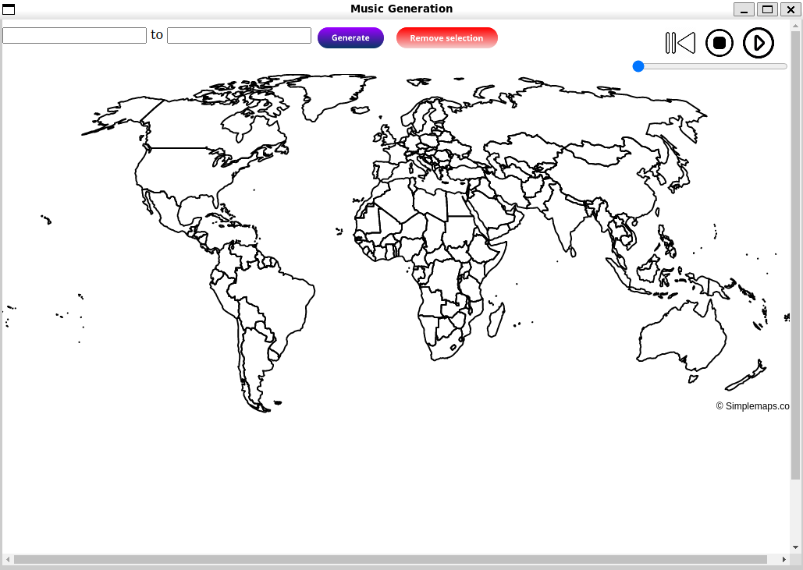

# Geosynth
Sonification of geo-location using Auto-encoder



## How to run

**Clone the repository**

```bash
git clone https://github.com/enter-opy/geosynth.git
cd geosynth
```

**Create and activate conda environment**

```bash
conda create -n geosynth python=3.10
conda activate geosynth
```

**Install CUDA and CuDNN**

```bash
conda install -c conda-forge -y cudatoolkit=11.2 cudnn=8.1
```

**Install dependencies**

```bash
pip install -r requirements.txt
```

**Run geosynth**

```bash
CUDA_VISIBLE_DEVICES=0 TF_CPP_MIN_LOG_LEVEL=3 python main.py
```

